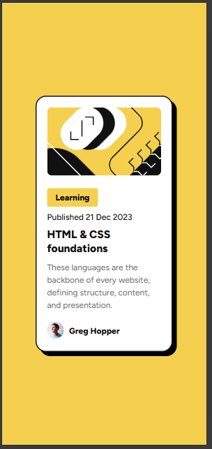

# Frontend Mentor - Blog preview card solution

## Table of contents

- [Overview](#overview)
  - [The challenge](#the-challenge)
  - [Screenshot](#screenshot)
  - [Links](#links)
- [My process](#my-process)
  - [Built with](#built-with)

## Overview

This is a blog review card designed using plain html and css, ensured resposiveness and hover effects.

### Screenshot

### Links

- Live Site URL: [View website here]([https://your-live-site-url.com](https://maryam-hytham.github.io/Blog-preview-card/))

## My Process

### Built with

- Semantic HTML5 markup
- CSS custom properties
- Flexbox
